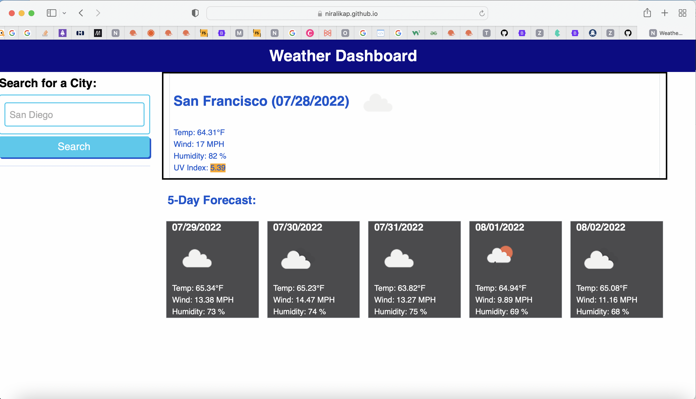
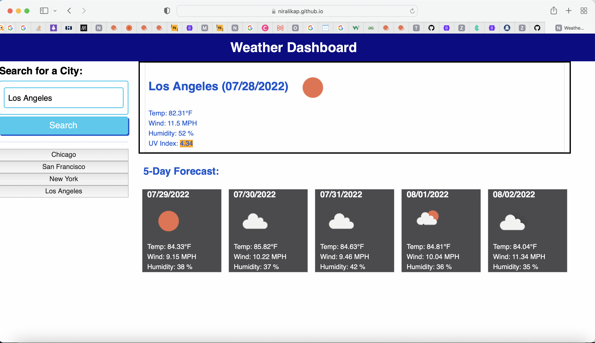
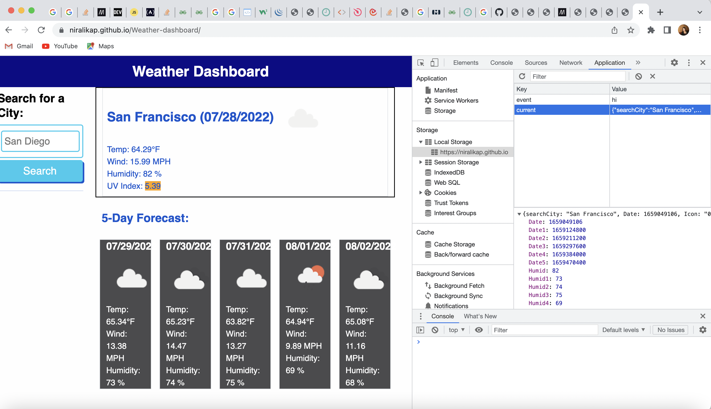

# 06 Server-Side APIs: Weather Dashboard (Challenge-7/26/22)

##Description

In this challenge, I have developed a weather dashboard that will run in the browser and feature dynamically updated HTML and CSS. I have used the server side/third party APIs to access the data and functionality by making requests with specific parameters to a URL. This application allows to see the weather outlook for multiple cities so the users can plan a trip accordingly. 

It has the following features:

-When I search for a city, then I am presented with current and future conditions for that city and that city is added to the search history.

-When I view current weather conditions for that city, then I am presented with the city name, the date, an icon representation of weather conditions, the temperature, the humidity, the wind speed, and the UV index.

-When I view the UV index, then I am presented with a color that indicates whether the conditions are favorable, moderate, or severe.

-When I view future weather conditions for that city, then I am presented with a 5-day forecast that displays the date, an icon representation of weather conditions, the temperature, the wind speed, and the humidity.

-When I click on a city in the search history, then I am again presented with current and future conditions for that city.

-The application uses the OpenWeather API to retrieve weather data. There are 2 API query URLs used - one retrieves the city name and the other uses the city name, latitude, and longitude details to get the weather conditions (date, icon image, temperature, humidity, wind speed and the UV index).

-The data is stored in the local storage.

